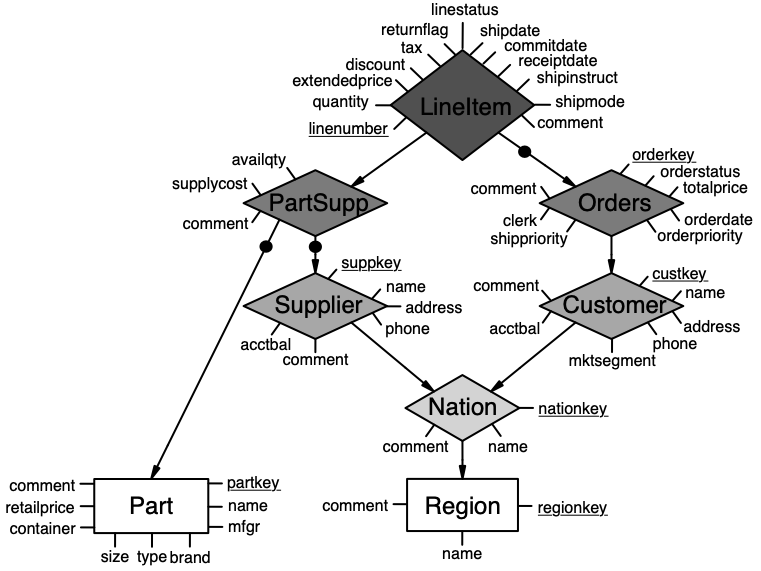

# Entity/Relationship Modelling for (De-)Normalization

## Introduction

This repository contains all experimental code used in our study, including both the TPC-H benchmark experiments and the synthetic sports case study.

### Repository Layout

- [`tpch-dbgen-Mac-main/`](tpch-dbgen-Mac-main/): DBGEN-based TPC-H data generation and PostgreSQL loading files.
- [`tpch_sf_01/`](tpch_sf_01/): TPC-H experiment code, including materialized-view generation, standard-view generation, query templates, multi-template plans, benchmark runners, and materialized-view refresh experiments.
- [`case_study/`](case_study/): A separate sports-stats case study that builds a synthetic normalized database, runs single-view and multi-view denormalization experiments, and analyzes meet/join choices.

The data-generation directory is named [`tpch-dbgen-Mac-main/`](tpch-dbgen-Mac-main/) in this repository. It contains its own README with detailed DBGEN usage instructions. Use that README as the primary guide for generating and loading TPC-H data.

## Experimental Environment Setup

### Software Requirements

The experiments require the following software:

- PostgreSQL (version 18 or later recommended)
- Conda (Miniconda or Anaconda)

Install PostgreSQL and create a PostgreSQL server before running the experiments. 
After installation, create the databases required by the experiments (e.g., `tpch_sf_01` for the TPC-H benchmark and `sportsdb` for the sports case study).

### Conda Environment

All experiment scripts should be run inside the provided Conda environment.

Create the environment from the supplied [`environment.yml`](environment.yml)
file:

```bash
conda env create -f environment.yml
```

Activate the environment:

```bash
conda activate Tpch_Join_Experiment
```

After activation, verify that the required packages are available:

```bash
python -c "import psycopg2, openpyxl; print('environment ok')"
```

Then run the experiment scripts using the activated environment.


## Experiments
This repository contains two experimental datasets used for different purposes in the paper.

### Sports Database
The sports database is a synthetic dataset developed for the case study. It is used to illustrate the denormalization lattice and investigate the view selection phenomena discussed in the paper.

<p align="center">
    
</p>

The schema consists of four relations connected through primary-key/foreign-key relationships.

Detailed instructions for reproducing the sports case study are provided in [`case_study/README.md`](case_study/README.md).

### TPC-H Benchmark

The TPC-H benchmark is used to evaluate the proposed denormalization techniques under a realistic analytical workload. Its schema consists of eight relations connected by primary-key/foreign-key relationships.

<p align="center">
    
</p>

The benchmark experiments construct materialized views or standard PostgreSQL views by joining subsets of these relations according to either schema-driven or query-driven denormalization strategies. 
Query execution time and materialized-view maintenance costs are then evaluated on these denormalized structures.

Detailed instructions for reproducing the TPC-H benchmark experiments are provided in [`tpch_sf_01/README.md`](tpch_sf_01/README.md).


