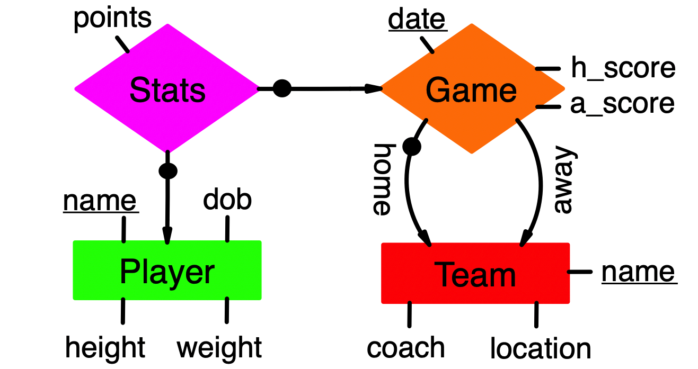

# Synthetic Sports Case Study

This directory contains a synthetic sports-statistics database and the
denormalization experiments that run on it. The standalone
[`build_sports_db.py`](build_sports_db.py) script creates and populates the
normalized PostgreSQL database used by the case study.

> **Warning:** every run drops and recreates the `team`, `player`, `game`, and
> `stats` tables with `CASCADE`. Dependent views and materialized views are also
> removed. Run the script only against a disposable experiment database, not a
> production database.
 
## What the builder creates

The script creates four normalized relations:

| Relation | Primary key | Foreign keys | Purpose |
|---|---|---|---|
| `team` | `name` | — | Fixed set of teams, coaches, and locations |
| `player` | `name` | — | All distinct players seen across the generated seasons |
| `game` | `(date, h_name)` | `h_name → team.name`, `a_name → team.name` | Home/away games and scores |
| `stats` | `(date, h_name, p_name)` | `p_name → player.name`, `(date, h_name) → game.(date, h_name)` | Per-player statistics for each game |

The normalized E/R diagram is as follows:

<p align="center">
  
</p>

## Reproducing the full experiment

The canonical entry point is
[`run_denorm_experiment_full_check.py`](run_denorm_experiment_full_check.py).
It imports database-generation and Single-strategy helpers from
[`run_denorm_experiment_single.py`](run_denorm_experiment_single.py), then runs
DB0, the 15 Single strategies, and the 7 complementary Multi/Pair strategies.


### Step 1: configure the environment and PostgreSQL

All required Python packages are listed in [`environment.yml`](../environment.yml).
Create the environment once, then activate it whenever reproducing the
experiment:

```bash
conda env create -f environment.yml
conda activate Tpch_Join_Experiment
```
If the environment already exists, only the `conda activate` command is
needed. No separate `pip install` step is required.


### Step 2: run SF10 and SF100

Run the following command from the repository root. All experiment-defining
defaults are written explicitly so that a later code change does not silently
change the reproduced configuration:

```bash
python case_study/run_denorm_experiment_full_check.py \
    --sf-sweep 10,100 \
    --per-game 30 \
    --seed 42 \
    --view-type materialized \
    --dbs all \
    --pairs all \
    --queries all \
    --query-repeats 40 \
    --warmup 2 \
    --agg mean \
    --optimize B \
    --mv-indexes all \
    --work-mem 256MB \
    --max-parallel 0 \
    --xlsx case_study/denorm_full_results_with_fk.xlsx \
    --user YOUR_USERNAME \
    --password YOUR_PASSWORD
```

Replace the connection placeholders with local PostgreSQL credentials.

This is a long-running experiment. SF100 contains 123,000 games and 3,690,000
stats rows, and the complete configuration executes all 22 strategies with 40
timed repetitions per measured SQL component. Do not interrupt the process:
the workbook is written only after the complete SF sweep succeeds.


### Step 3: inspect the workbook

The reproduction command writes
`case_study/denorm_full_results_with_fk.xlsx` with four sheets:

| Sheet | Contents |
|---|---|
| `summary` | One row per SF, strategy, and view type, including create/workload/total time and logical redundancy |
| `per_query_time` | Aggregated execution time for each selected Q1–Q15 query |
| `per_query_saving` | `DB0 query time − strategy query time` for each query |
| `single_style_summary` | DB0 and Single rows in the compact format used by the original Single runner |


### Step 4: Analysis

After the workbook is complete, run:

```bash
python case_study/analyze_meet_join.py \
    --xlsx case_study/denorm_full_results_with_fk.xlsx \
    --heatmap \
    --sfs 10,100 \
    --delta-direction saving \
    --figure-dir case_study/figures/sports_case_study
```

This produces:

```text
case_study/figures/sports_case_study/
├── per_query_saving_heatmap_sf10.png
└── per_query_saving_heatmap_sf100.png
```

## Running the unified partial experiment

[`run_denorm_experiment_unified.py`](run_denorm_experiment_unified.py) is a materialized-view-only runner for targeted experiments. 
It can measure selected Single nodes (`DB0` through `DB15`) and selected complementary Multi/Pair strategies in one invocation. 
For every selected strategy, it records the total workload time and the individual execution time and DB0-relative saving of each selected query.

The following command runs the partial SF10/SF100 configuration. 
Run it from the `case_study` directory so that its default output files are created there:

```bash
cd case_study

python run_denorm_experiment_unified.py --sf-sweep 10,100 \
    --dbname sportsdb --user YOUR_USERNAME --password YOUR_PASSWORD \
    --dbs 0,1,3,4,6,8,10,13 --queries 1,3,4,6,8,10,13 --pairs none \
    --optimize B
```

Replace the connection placeholders with local PostgreSQL credentials.
This configuration always measures the normalized `DB0` baseline, then measures DB1, DB3, DB4, DB6, DB8, DB10, and DB13 for queries Q1, Q3, Q4, Q6, Q8, Q10, and Q13. 
Because `--pairs none` disables all complementary-pair strategies, `--optimize B` has no effect on this particular run; optimization A/B is used only when at least one pair is selected. 
Use `--pairs all` to include all seven complementary pairs.
Unless overridden with `--xlsx` or `--queries-file`, the command writes these
files inside `case_study`:

- `denorm_unified_results_partial.xlsx`, containing `summary`,
  `per_query_time`, and `per_query_saving`
- `workload_queries_partial.sql`, containing the generated Q1–Q15 SQL

The script rebuilds the experiment tables for every scale factor, so use a disposable PostgreSQL database. The workbook is written only after the complete SF sweep finishes successfully.
